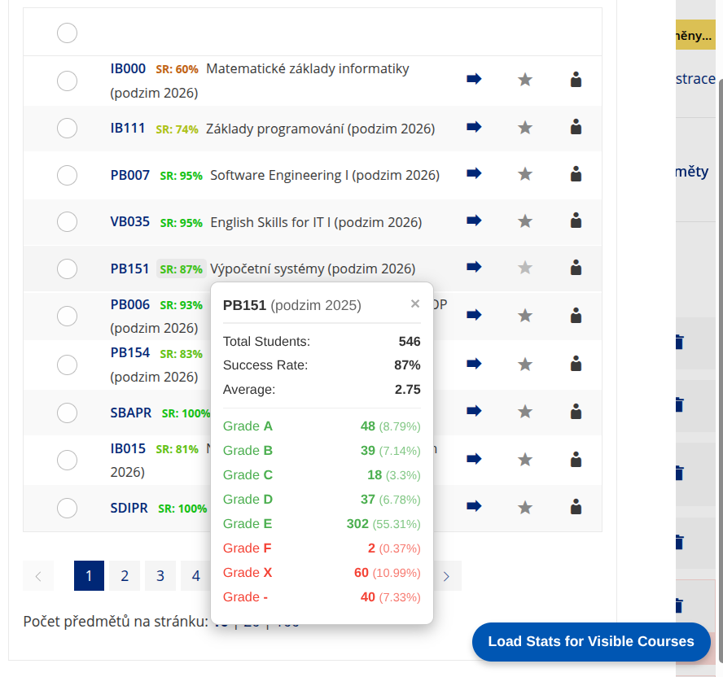

# IS MUNI Course Stats Enhancer

A lightweight JavaScript script that dynamically fetches and displays course success rates directly next to course links on IS MUNI. It prevents you from having to click through multiple pages just to see if a course is easy or hard!



## Features
* **At-a-Glance Success Rates:** Adds a color-coded badge (e.g., `SR: 90%`) next to every course link. Colors scale from Red (low success) to Green (high success).
* **Detailed Popups:** Click on any badge to view a detailed popup containing the semester, total student count, average grade, and a breakdown of all assigned grades (A, B, C, D, E, F, Z, etc.).
* **Pass/Fail Highlighting:** Grades in the popup are automatically colored green (pass) or red (fail).
* **Smart Viewport Loading:** To prevent making 1000+ requests at once and overloading the IS MUNI servers, stats are only fetched for courses that are *currently visible on your screen* when you click the floating **"Load Stats for Visible Courses"** button. Simply scroll down to the courses you are interested in and click the button to load the next batch!

---

## How to Use

There are two ways to use this script: 

### Method 1: The Quick Way (Browser Developer Console)
This method is temporary and needs to be repeated every time you refresh the page.

1. Open any page on [is.muni.cz](https://is.muni.cz/) that contains course links (e.g., your study planner or course registration page).
2. Open the browser's Developer Console by pressing `F12` (or `Ctrl + Shift + J` on Windows / `Cmd + Option + J` on Mac).
3. Copy the entire JavaScript code and paste it into the Console tab.
4. Press `Enter`.
5. A blue button will appear in the bottom-right corner of the screen. Click **"Load Stats for Visible Courses"** to see the magic happen!

### Method 2: The Permanent Way (Browser Extension / Userscript)
This is the recommended method. The script will run automatically every time you visit IS MUNI.

1. Install a Userscript manager extension for your browser, such as **[Tampermonkey](https://www.tampermonkey.net/)** or **[Violentmonkey](https://violentmonkey.github.io/)**.
2. Click on the extension icon and select **"Create a new script"**.
3. Delete any default code in the editor and paste the provided code.
4. **Important:** Add this metadata block to the very top of the script so the extension knows where to run it:

```javascript
// ==UserScript==
// @name         IS MUNI Course Stats Enhancer
// @namespace    http://tampermonkey.net/
// @version      1.0
// @description  Displays course success rates on IS MUNI directly next to the links.
// @match        *://is.muni.cz/*
// @grant        none
// ==/UserScript==

(async function() {
    // ... paste the rest of the script here ...
})();
```
5. Save the script (`Ctrl + S` or `Cmd + S`).
6. Refresh your IS MUNI page. The floating blue button will now be waiting for you in the bottom right corner!

---

## Configuration

If you want to change which grades are considered a "pass" or a "fail" (which affects the colors inside the detailed popup), you can edit the `GRADE_CATEGORIES` dictionary at the very top of the script:

```javascript
const GRADE_CATEGORIES = {
    'A': 'pass', 'B': 'pass', 'C': 'pass', 'D': 'pass', 'E': 'pass', 'Z': 'pass', 'P': 'pass',
    'F': 'fail', '-': 'fail', 'N': 'fail', 'X': 'fail',
};
```
